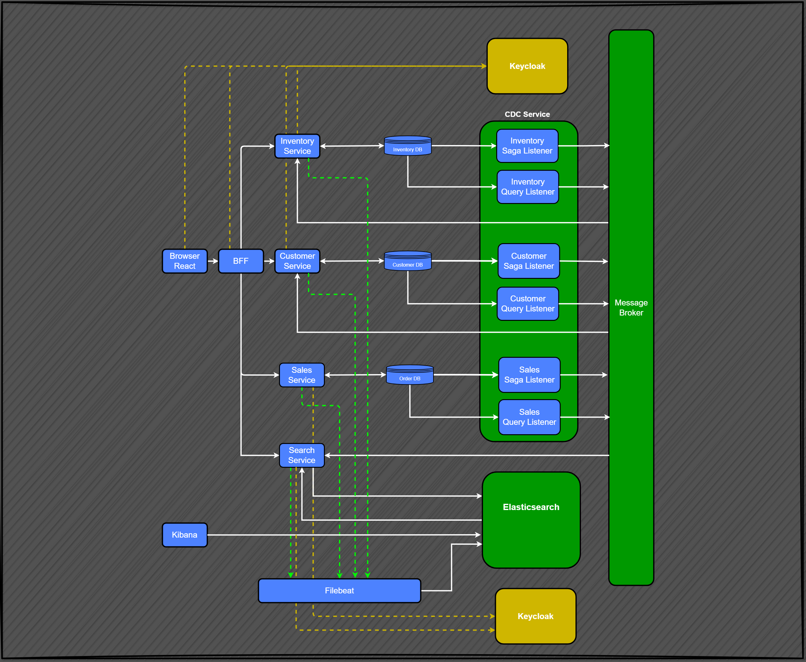

# Salespoint is a distributed appliction 

The application relies o a react ts frontend, raphql/ts backend and myraid of java services to implement the saga pattern.
The application uses, kafka and elastic search to enable it to function and provide certain features.

## Architecture

